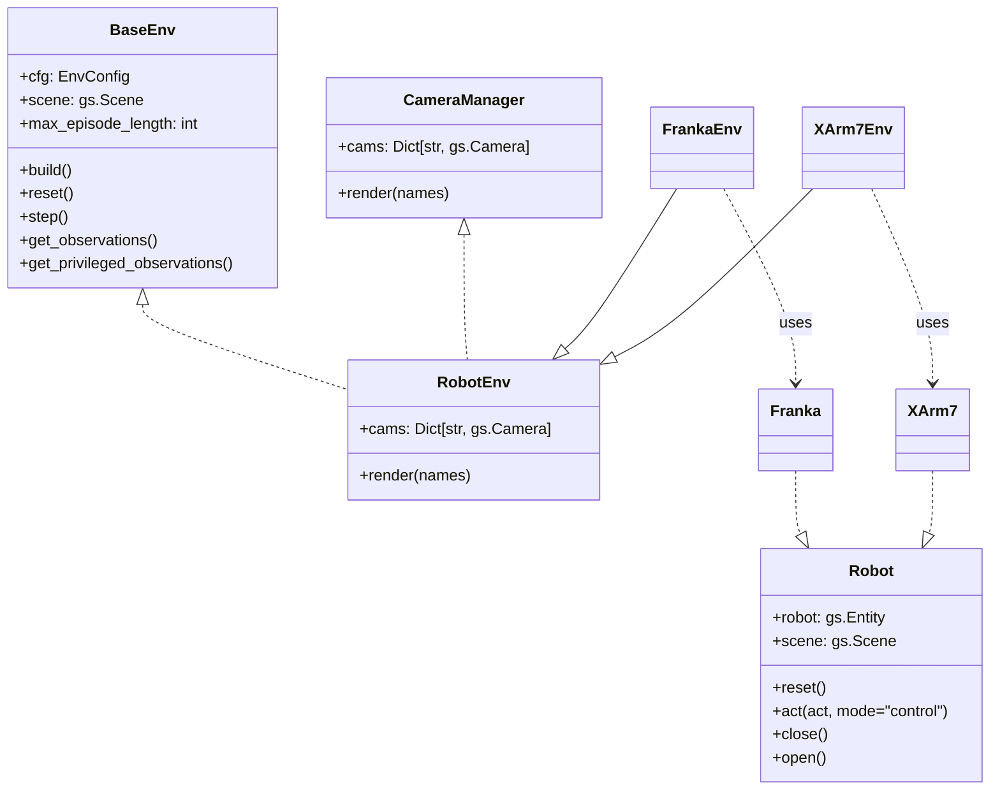

# Quick Start

## via UV

    curl -LsSf https://astral.sh/uv/install.sh | sh
    uv run main.py

##  via Conda

    conda create -n tag python=3.11
    conda activate tag
    pip install -e .
    python main.py

## Protocol Interfaces

